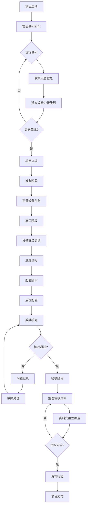
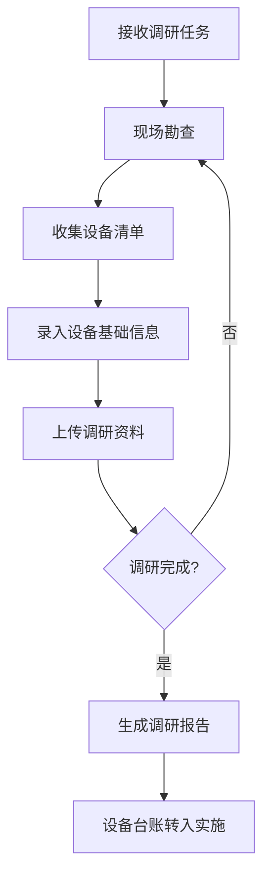
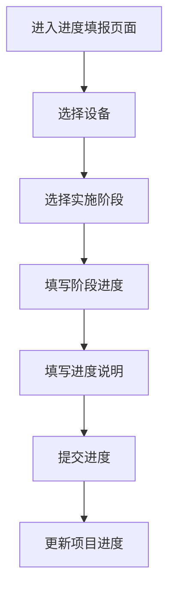
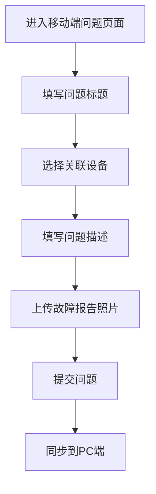
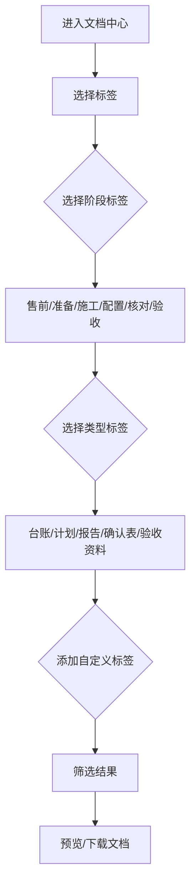

# 数采项目管理系统 - 软件需求概要设计

**文档版本**：V1.3
**创建日期**：2026-02-04
**文档状态**：修订版
**修订说明**：V1.3 - 明确项目计划仅针对实施阶段，调整文档中心页面结构，优化移动端功能范围

---

## 一、设计思路

### 1.1 定位与目标

**产品定位**：面向数字化实施团队的内部数采项目管理工具，覆盖售前调研到项目验收全流程

**核心目标**：规范化管理数采项目从售前调研、实施到验收的全过程，提升项目交付质量和效率

**服务对象**：售前工程师、实施工程师、项目经理、现场施工人员、项目干系人

### 1.2 整体设计理念

1. **以设备为中心**：设备台账是系统核心，从售前调研开始形成雏形，贯穿项目全生命周期
2. **全流程覆盖**：售前调研→准备→施工→配置→核对→验收，完整闭环
3. **流程驱动**：围绕6个阶段（售前调研、准备、施工、配置、核对、验收）设计工作流
4. **渐进式明细**：项目计划从阶段级细化到设备级，支持进度填报和可视化
5. **移动优先**：关键功能支持H5移动端，嵌入钉钉，方便现场人员使用

### 1.3 系统边界

#### 包含范围

- **售前调研阶段**：数采需求调研、设备清单收集、现场勘查、设备台账雏形建立
- **项目实施管理**：准备→施工→配置→核对四个阶段
- **项目验收阶段**：资料文档归类整理、验收交付
- **设备台账管理**：设备信息、采集配置、状态跟踪（从售前到实施全周期）
- **项目计划管理**：多层级计划、进度填报、甘特图展示
- **问题管理**：问题记录、故障报告上传、处理跟踪
- **文档资料管理**：标签化分类存档、版本管理、权限控制

#### 不包含范围（明确边界）

- **商机管理**：商机线索、客户信息等由CRM系统管理
- **报价合同**：报价单、合同审批等由商务系统管理
- **财务管理**：成本核算、费用报销等由财务系统管理
- **人力资源管理**：人员考勤、绩效等由HR系统管理
- **生产管理**：设备实时监控、数据分析等由MES系统管理

### 1.4 关键设计决策

#### 决策1：项目阶段划分

- **选择**：6个阶段（售前调研、准备、施工、配置、核对、验收）
- **原因**：
  - 售前调研是设备台账形成的关键阶段
  - 验收阶段用于资料文档归类和项目交付
- **影响**：项目流程延长，设备状态需要支持售前和验收阶段

#### 决策2：设备台账的粒度

- **选择**：设备级管理（非点位级）
- **原因**：降低管理复杂度，点位信息可通过附件形式关联
- **影响**：设备是项目计划、进度填报、文档归档的基本单元
- **售前阶段**：设备台账在售前阶段形成雏形（基础信息），实施阶段逐步完善
- **进度填报**：填报设备在实施各阶段（准备/施工/配置/核对）的进度

#### 决策3：文档标签化管理

- **选择**：采用标签+分类的双重管理方式
- **原因**：提升文档检索和管理的灵活性，支持多维度组织
- **标签类型**：
  - 阶段标签：售前、准备、施工、配置、核对、验收
  - 类型标签：台账、计划、报告、确认表、验收资料、模板
  - 自定义标签：用户可自定义标签
- **影响**：文档管理更加灵活，但也需要规范的标签体系

#### 决策4：移动端功能范围

- **选择**：H5嵌入钉钉，聚焦现场必需功能
- **移动端功能**：
  - 设备扫码查看
  - 问题上报（创建问题、上传故障报告）
  - 文档查阅
- **PC端保留**：计划制定、进度填报、复杂配置、报表分析

#### 决策5：项目计划的层级

- **三级计划体系**（仅针对实施阶段）：
  1. 阶段计划：准备/施工/配置/核对（4个实施阶段）
  2. 任务计划：每个阶段下的任务清单
  3. 设备阶段计划：每个设备在各实施阶段的进度计划
- **细化粒度**：进度填报到设备的具体阶段（如施工、配置、核对），可视化到项目级

### 1.5 已确认业务规则

根据业务方确认，以下业务规则已明确：

#### 规则1：阶段流转规则
- **售前调研转入实施**：无需审批流程，调研完成后直接转入实施阶段
- **实施阶段流转**：准备→施工→配置→核对→验收，按项目实际进度自动流转

#### 规则2：进度填报规则
- **填报方式**：PC端填报（不支持移动端）
- **填报粒度**：填报设备在各实施阶段（准备/施工/配置/核对）的进度
- **生效机制**：填报后直接生效，无需审核
- **填报内容**：设备所在阶段、完成进度、完成情况说明

#### 规则3：设备台账规则
- **售前阶段必填项**：
  - 设备名称
  - 设备型号
  - 设备类型
  - 设备品牌
  - 现场照片（至少1张）
- **实施阶段完善项**：
  - IP地址
  - 采集协议
  - 点位表
  - 状态逻辑配置

#### 规则4：文档标签规则
- **标签体系**：系统预设标签 + 用户自定义标签
- **阶段标签**（系统预设）：售前、准备、施工、配置、核对、验收
- **类型标签**（系统预设）：台账、计划、报告、确认表、验收资料、模板
- **自定义标签**：用户可创建个性化标签，支持标签分组

#### 规则5：移动端功能规则
- **支持功能**：设备扫码查看、问题创建、文档查阅
- **不支持功能**：进度填报（仅PC端支持）
- **问题创建**：移动端可快速创建问题，支持上传故障报告和照片

---

## 二、系统功能菜单清单

### 2.1 一级菜单结构

```
数采项目管理系统
├── 工作台
├── 项目管理
│   ├── 项目列表
│   ├── 项目详情
│   └── 项目仪表盘
├── 设备管理
│   ├── 设备列表
│   ├── 设备类型管理
│   └── 设备详情
├── 计划管理
│   ├── 项目计划
│   ├── 进度填报
│   └── 甘特图视图
├── 问题管理
│   ├── 问题列表
│   ├── 我的问题
│   └── 故障报告
├── 文档中心
│   ├── 项目文档
│   └── 标签管理
└── 系统管理
    ├── 用户管理
    ├── 角色权限
    └── 基础配置
```

### 2.2 功能模块详细说明

#### 模块1：工作台

**功能定位**：个人工作中心，快速访问待办和概览

**核心功能**：
- 待办事项：待填报进度、待处理问题、待审阅文档
- 我的项目：参与项目列表和快速跳转
- 进度预警：延期任务、异常设备提醒
- 通知公告：系统通知、项目动态

---

#### 模块2：项目管理

**功能定位**：项目全生命周期管理（从售前调研到验收）

**核心功能**：
- **项目列表**：多维度筛选（状态、阶段、负责人）
- **项目详情**：
  - 项目基本信息
  - 实施阶段看板（售前调研→准备→施工→配置→核对→验收）
  - 项目进度总览
  - 关联设备和人员
  - 售前调研摘要（调研报告、设备清单）
  - 验收资料清单（验收阶段归档）
- **项目仪表盘**：进度、问题、文档的综合视图

**页面清单**：

| 页面名称 | 页面路径 | 页面描述 | 主要栏目 | 数据流向 |
|---------|---------|---------|---------|---------|
| 项目列表 | /project/list | 展示所有项目，支持筛选和搜索 | 筛选区、项目列表、分页器 | 输入：筛选条件<br>输出：跳转项目详情 |
| 项目详情 | /project/detail/:id | 单项目的完整信息视图 | 基本信息、阶段看板、关联列表 | 输入：项目ID<br>输出：跳转子模块 |
| 项目仪表盘 | /project/dashboard/:id | 项目数据可视化分析 | 进度图表、问题统计、文档概览 | 输入：项目ID<br>输出：可视化报表 |

---

#### 模块3：设备管理

**功能定位**：设备信息管理，是系统的核心基础模块，从售前到实施全周期管理

**核心功能**：
- **设备列表**：
  - 多维度筛选：按项目、类型、状态、阶段筛选
  - 设备类型管理：设备类型、品牌、型号等维度管理
  - 支持批量导入（Excel模板）
  - 列表直接查看设备详情（抽屉或弹窗形式）

- **设备详情**（作为列表的子页面）：
  - 基本信息（设备名称、型号、位置、IP等）
  - 采集配置（协议、点位表、状态逻辑）
  - 实施进度（当前阶段：售前/准备/施工/配置/核对/验收）
  - 各阶段进度（准备/施工/配置/核对阶段的完成进度）
  - 关联文档（调研表、点位表、配置文档、确认表、验收资料）
  - 历史记录（状态变更、进度填报记录）

**设计要点**：
- 设备作为核心实体，与项目、计划、文档、问题建立关联
- **售前阶段**：设备台账建立雏形（基础信息：设备名称、型号、类型、品牌、现场照片）
- **实施阶段**：逐步完善设备信息（IP地址、采集协议、点位表等）
- 支持设备二维码生成，移动端扫码查看
- 设备类型支持树形结构管理

**页面清单**：

| 页面名称 | 页面路径 | 页面描述 | 主要栏目 | 数据流向 |
|---------|---------|---------|---------|---------|
| 设备列表 | /device/list | 展示所有设备，支持多维度筛选 | 筛选区、设备列表、分页器 | 输入：筛选条件<br>输出：打开详情抽屉 |
| 设备详情 | /device/detail/:id | 设备详情（子页面/抽屉） | 基本信息卡片、关联文档、进度、问题 | 输入：设备ID<br>输出：跳转关联内容 |
| 设备类型管理 | /device/type | 设备类型树形管理 | 类型树、类型列表 | 输入：类型操作<br>输出：更新类型数据 |

---

#### 模块4：计划管理

**功能定位**：项目实施阶段计划制定和进度跟踪（仅针对实施阶段，不包括售前调研和验收）

**核心功能**：
- **项目计划**：
  - 阶段计划：4个实施阶段的时间节点（准备、施工、配置、核对）
  - 任务计划：每个阶段下的任务分解
  - 设备阶段计划：每个设备在各实施阶段的计划进度
- **进度填报**（仅PC端）：
  - 按设备填报：选择设备→选择阶段→填写阶段进度
  - 批量填报：多个设备统一阶段进度
  - 直接生效：填报后立即更新进度（无需审核）
- **甘特图视图**：项目实施进度可视化展示

**设计要点**：
- 计划层级：项目→实施阶段→任务→设备阶段进度
- 进度填报以设备在各实施阶段的进度为最小单元
- 支持计划变更和版本管理
- 仅PC端支持进度填报，移动端不支持

**页面清单**：

| 页面名称 | 页面路径 | 页面描述 | 主要栏目 | 数据流向 |
|---------|---------|---------|---------|---------|
| 项目计划 | /plan/project/:id | 制定和调整项目实施计划 | 阶段计划、任务列表、甘特图 | 输入：计划配置<br>输出：保存计划 |
| 进度填报 | /plan/report/:deviceId | 填报设备实施阶段进度 | 进度表单、历史记录 | 输入：阶段进度数据<br>输出：更新进度 |
| 甘特图 | /plan/gantt/:id | 项目实施进度可视化 | 时间轴、任务条、进度标识 | 输入：项目ID<br>输出：展示图表 |

---

#### 模块5：问题管理

**功能定位**：项目问题和故障跟踪管理

**核心功能**：
- **问题列表**：按项目、状态、优先级筛选
- **问题详情**：
  - 问题描述（标题、详细说明、关联设备）
  - 故障报告上传（支持图片、文档）
  - 处理记录（分配、处理、验证、关闭）
  - 问题分类（硬件、软件、网络、配置等）
- **我的问题**：待处理、已提交、已抄送的问题
- **问题统计**：问题趋势、分类分布、处理时效

**设计要点**：
- 参考行业标准（如Bug管理系统）
- 支持故障报告模板化
- 问题状态流转：待处理→处理中→待验证→已关闭
- **移动端支持快速创建问题**：可上传故障报告和照片

**页面清单**：

| 页面名称 | 页面路径 | 页面描述 | 主要栏目 | 数据流向 |
|---------|---------|---------|---------|---------|
| 问题列表 | /issue/list | 展示所有问题，支持筛选 | 筛选区、问题列表、分页器 | 输入：筛选条件<br>输出：跳转问题详情 |
| 问题详情 | /issue/detail/:id | 单问题的完整信息和处理记录 | 基本信息、处理记录、故障报告 | 输入：问题ID<br>输出：更新问题状态 |
| 我的问题 | /issue/my | 个人问题视图 | 待处理、已提交、已抄送 | 输出：跳转问题详情 |
| 问题统计 | /issue/statistics | 问题数据统计分析 | 图表、统计指标 | 输出：可视化报表 |

---

#### 模块6：文档中心（标签化管理）

**功能定位**：项目文档和资料的集中管理，支持标签化灵活分类

**核心功能**：
- **项目文档**：
  - 按标签筛选：阶段标签（售前/准备/施工/配置/核对/验收）、类型标签（台账/计划/报告/确认表/验收资料/模板）
  - 自定义标签：用户可创建和管理自定义标签
  - 版本管理：支持多版本和历史记录
  - 标签组合筛选：支持多标签组合查询
  - 文档上传和下载
  - 在线预览（PDF、图片、Office文档）

- **标签管理**：
  - 系统标签：预定义的阶段标签、类型标签
  - 自定义标签：用户创建的个性化标签
  - 标签分组：支持标签分组管理
  - 标签统计：展示标签使用频率

**文档属性要求**（来自需求点8）：
- **标签体系**：阶段标签 + 类型标签 + 自定义标签
- **说明备注**：文档用途和关键信息说明
- **对应阶段**：所属项目阶段（包含验收阶段）
- **提供方**：谁提供（内部/客户）
- **接收方**：提供给谁（内部/客户）
- **版本号**：文档版本标识
- **验收标识**：是否为验收资料（验收阶段专用）

**设计要点**：
- 文档与项目、设备关联
- 支持在线预览（PDF、图片、Office文档）
- 支持批量上传和下载
- 移动端支持查阅
- 标签化管理提升检索灵活性

**页面清单**：

| 页面名称 | 页面路径 | 页面描述 | 主要栏目 | 数据流向 |
|---------|---------|---------|---------|---------|
| 项目文档 | /doc/project/:id | 项目文档列表和管理 | 标签筛选区、文档列表、上传下载 | 输入：标签筛选<br>输出：文档文件 |
| 标签管理 | /doc/tag | 标签创建和管理 | 系统标签、自定义标签、标签分组 | 输入：标签操作<br>输出：更新标签数据 |

---

#### 模块7：系统管理

**功能定位**：系统基础数据和权限管理

**核心功能**：
- **用户管理**：用户信息、角色分配
- **角色权限**：角色定义、权限配置
- **基础配置**：设备分类、问题分类、文档分类等

---

## 三、核心业务流程

### 3.1 项目全生命周期主流程



### 3.2 售前调研流程（新增）



### 3.3 设备台账全生命周期流程


### 3.4 进度填报流程（PC端）



### 3.5 问题创建流程（移动端）



### 3.6 文档标签化筛选流程



---

## 四、数据模型核心关系

### 4.1 核心实体关系

```
项目 (Project)
  ├── 阶段 (Stage) - 售前调研/准备/施工/配置/核对/验收
  ├── 设备 (Device)
  │   ├── 售前信息 (PreSaleInfo)
  │   ├── 进度记录 (Progress)
  │   ├── 关联文档 (Document)
  │   └── 关联问题 (Issue)
  ├── 任务 (Task)
  └── 文档 (Document)

设备 (Device)
  ├── 设备类型 (DeviceType)
  ├── 售前基础信息
  ├── 实施详细信息
  └── 状态流转记录

文档 (Document)
  ├── 标签 (Tag)
  │   ├── 系统标签 (SystemTag)
  │   └── 自定义标签 (CustomTag)
  ├── 版本 (Version)
  └── 权限 (Permission)

问题 (Issue)
  ├── 关联设备
  ├── 关联项目
  └── 故障报告 (Attachment)

用户 (User)
  ├── 角色 (Role)
  └── 参与项目 (ProjectUser)
```

### 4.2 设备核心属性（支持售前阶段）

```javascript
{
  id: "设备唯一标识",
  projectId: "所属项目",
  name: "设备名称",
  type: "设备类型",
  model: "设备型号",
  location: "安装位置",

  // 售前阶段信息（雏形）
  preSaleInfo: {
    collector: "调研负责人",
    surveyDate: "调研日期",
    basicInfo: "基础信息说明",
    sitePhotos: ["现场照片"],
    surveyReport: "调研报告附件"
  },

  // 实施阶段信息（逐步完善）
  ipAddress: "设备IP",
  protocol: "采集协议",
  pointTable: "点位表附件",
  logicConfig: "状态逻辑配置",

  stage: "当前阶段", // 售前/准备/施工/配置/核对/验收
  status: "设备状态", // 未开始/进行中/已完成/异常

  // 各实施阶段进度（仅实施阶段有数据）
  stageProgress: {
    preparation: "准备阶段进度(%)",
    construction: "施工阶段进度(%)",
    configuration: "配置阶段进度(%)",
    verification: "核对阶段进度(%)"
  },

  collector: "实施负责人",
  configFiles: ["配置文件附件"],
  qrCode: "二维码"
}
```

### 4.3 文档标签模型

```javascript
{
  id: "文档唯一标识",
  projectId: "所属项目",
  deviceId: "关联设备（可选）",
  name: "文档名称",
  fileType: "文件类型",

  // 标签体系
  tags: {
    stageTags: ["售前", "准备", "施工", "配置", "核对", "验收"], // 阶段标签（多选）
    typeTags: ["台账", "计划", "报告", "确认表", "验收资料", "模板"], // 类型标签（多选）
    customTags: ["客户名称", "项目编号", "紧急"] // 自定义标签
  },

  // 文档属性
  attributes: {
    description: "说明备注",
    provider: "提供方（内部/客户）",
    receiver: "接收方（内部/客户）",
    version: "版本号",
    isAcceptance: "是否验收资料" // 验收阶段专用
  },

  // 版本管理
  version: "当前版本",
  versions: ["历史版本列表"],

  // 权限控制
  permissions: {
    view: ["可查看用户/角色"],
    download: ["可下载用户/角色"],
    edit: ["可编辑用户/角色"]
  }
}
```

---

## 五、非功能性需求

### 5.1 兼容性要求

- PC端：Chrome、Edge、Firefox最新版
- 移动端：钉钉H5、iOS Safari、Android Chrome

### 5.2 安全要求

- 用户登录认证（支持钉钉扫码登录）
- 基于角色的权限控制
- 文档访问权限控制
- 操作日志记录

### 5.3 可用性要求

- 系统可用性 > 99%
- 数据每日自动备份

---

## 六、待明确事项

### 6.1 业务规则待确认

1. 设备台账在售前阶段的必填字段已确认（设备名称+型号、现场照片、设备类型+品牌）
2. 从售前阶段转入实施阶段，无需审批流程（已确认）
3. 进度填报直接生效，无需审核（已确认）
4. 验收阶段的资料清单标准是什么？
5. 验收资料完整性检查的规则？
6. 标签体系需要预设哪些系统标签？
7. 文档标签的数量限制（单个文档最多添加多少个标签）？
8. 问题处理的时效要求？是否有SLA规定？

### 6.2 技术选型待确认

1. 前端技术栈（React/Vue/Angular）
2. 后端技术栈（Java/Python/Node.js）
3. 数据库选择（MySQL/PostgreSQL）
4. 文件存储方案（本地存储/OSS）
5. 移动端实现方式（H5/小程序/原生）

### 6.3 集成关系待确认

1. 是否与钉钉深度集成（消息推送、组织架构同步）？
2. 是否与其他系统集成（ERP、MES等）？
3. 是否需要开放API接口？

---

## 七、下一步工作计划

### 7.1 需求细化

1. 与业务方确认待明确事项
2. 收集各阶段的标准文档模板
3. 梳理典型用户场景和用例
4. 确定标签体系规范（系统标签预设）

### 7.2 原型设计

1. 设计核心页面的低保真原型
2. 重点设计售前调研、验收资料整理和标签筛选功能
3. 评审并迭代优化

### 7.3 详细设计

1. 数据库详细设计
2. API接口设计
3. 权限模型设计
4. 标签体系设计

---

## 八、附录

### 8.1 参考文档

- 《数采实施过程管理要求V1.1》
- 《数采项目需求思维导图》
- 现场调研表、进度计划表、问题记录表等模板

### 8.2 术语表

| 术语 | 说明 |
|-----|------|
| 数采 | 数据采集，指从设备中采集生产数据的过程 |
| 设备台账 | 记录设备基本信息的清单，从售前到实施逐步完善 |
| 售前调研 | 项目实施前的现场勘查和设备信息收集阶段 |
| 点位表 | 定义设备采集点的数据表 |
| 状态逻辑关系表 | 定义设备状态计算逻辑的配置表 |
| 甘特图 | 项目进度可视化图表 |
| 标签 | 用于文档分类和检索的标记，支持多标签组合 |

### 8.3 版本记录

| 版本 | 日期 | 说明 |
|-----|------|------|
| V1.0 | 2026-02-04 | 初稿，聚焦实施阶段 |
| V1.1 | 2026-02-04 | 修订版：增加售前调研阶段、文档标签化管理、调整菜单结构 |
| V1.2 | 2026-02-04 | 修订版：增加验收阶段，用于资料文档归类整理 |
| V1.3 | 2026-02-04 | 修订版：明确项目计划仅针对实施阶段，调整文档中心页面结构，优化移动端功能范围 |

---

**文档结束**
