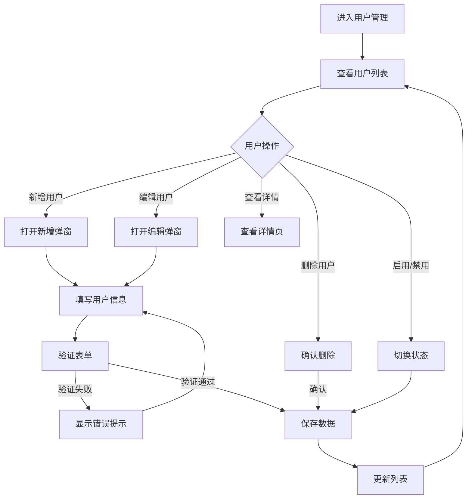
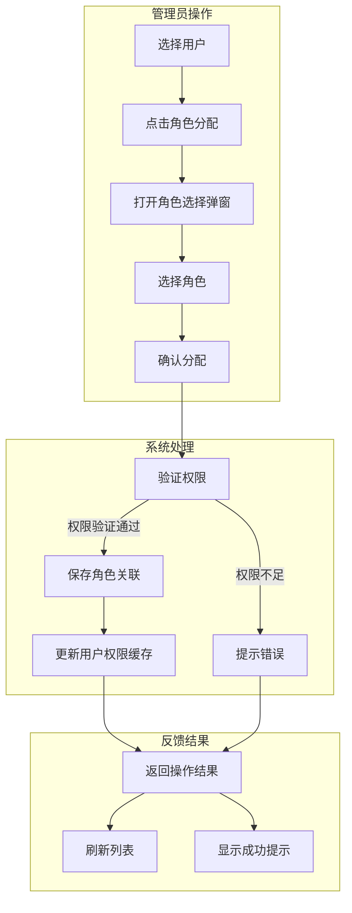
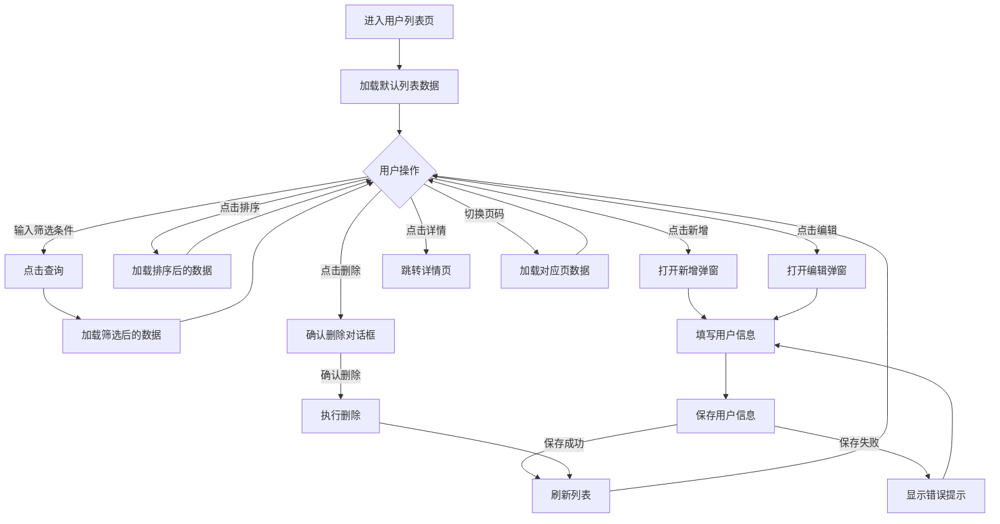
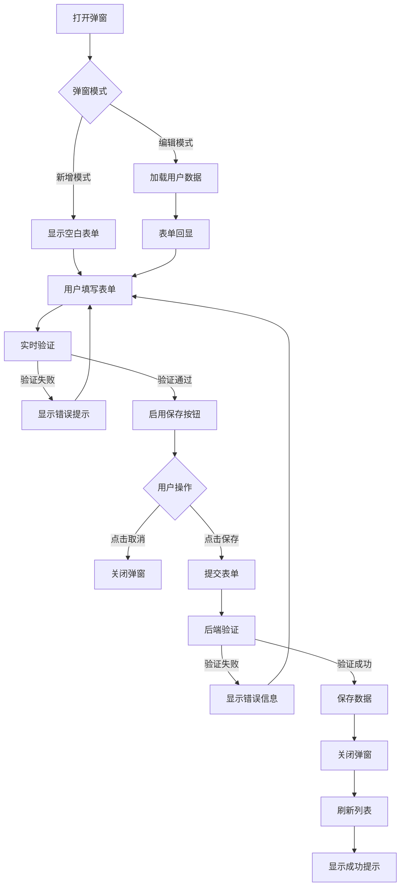
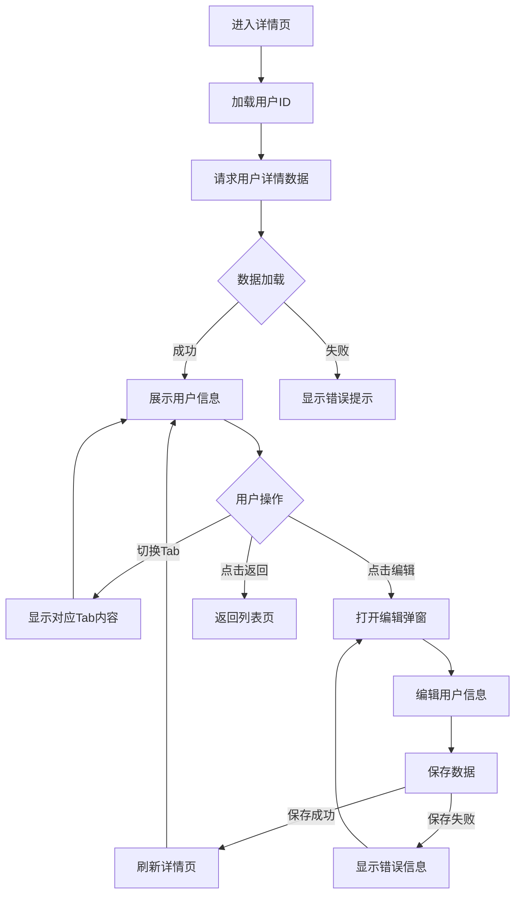

# 用户管理模块产品设计文档示例

> 本文档是《ProductDesign产品设计规范.md》的示例文档，展示了如何应用规范中的设计原则和界面规范。
>
> **关联文档**: [ProductDesign产品设计规范.md](../ProductDesign产品设计规范.md)

---

### 一、项目背景分析

#### 1.1 项目概述
本模块为企业级用户管理系统，旨在实现对系统用户的统一管理，包括用户的增删改查、角色权限分配、状态管理等功能。系统管理员可以通过该模块管理企业内部用户，分配用户角色，控制用户访问权限。

#### 1.2 目标用户
* **系统管理员**：拥有所有权限，负责用户管理和维护
* **部门管理员**：拥有部分权限，负责本部门用户管理
* **普通用户**：查看和编辑个人基本信息

#### 1.3 核心功能
* 用户列表查询和管理
* 新增用户
* 编辑用户信息
* 删除用户
* 查看用户详情
* 用户启用/禁用
* 批量导入/导出用户
* 用户角色分配

#### 1.4 设计要求
* 采用列表驱动设计，所有操作围绕用户列表展开
* 界面风格现代化，遵循Ant Design设计规范
* 响应式布局，支持桌面端和平板端
* 操作反馈及时，用户体验流畅

---

### 二、产品业务流程图

#### 2.1 用户管理主流程



#### 2.2 用户角色分配流程（泳道图）



---

### 三、页面清单

| 页面名称 | 页面路径 | 页面描述 | 主要栏目 | 数据流向 | 包含元素 | 其他 |
|---------|---------|---------|---------|---------|---------|------|
| 用户列表页 | /user/list | 展示系统用户列表，支持查询、筛选、新增、编辑、删除等操作 | 用户列表、筛选区、操作按钮 | 输入：筛选条件<br>输出：用户列表数据 | 筛选区、列表表格、分页器、新增按钮、批量操作按钮 | 系统主入口页面 |
| 用户详情页 | /user/detail/:id | 展示用户详细信息，包括基本信息、角色权限、操作记录等 | 基本信息、角色权限、操作记录 | 输入：用户ID<br>输出：用户详细信息 | 详情卡片、标签页、返回按钮、编辑按钮 | 从列表页点击"详情"进入 |
| 新增/编辑弹窗 | - | 弹窗形式的用户信息编辑表单 | 用户信息表单 | 输入：用户输入的表单数据<br>输出：保存后的用户数据 | 表单字段、保存按钮、取消按钮 | 弹窗形式，不从列表页跳转 |

---

### 四、页面设计详情

#### 4.1 用户列表页

##### 4.1.1 基本信息
* **页面标题**：用户列表
* **页面路径**：/user/list
* **功能状态**：新增

##### 4.1.2 页面概述
用户列表页是用户管理模块的核心页面，采用列表驱动设计，所有用户管理操作围绕列表展开。页面顶部提供筛选条件和页面级操作按钮（新增、导入、导出），中部为用户列表表格，底部为分页器。列表支持多条件筛选、排序、分页显示。

##### 4.1.3 页面功能流程



##### 4.1.4 数据流

**输入数据：**

| 数据类型 | 数据来源 | 数据格式 | 说明 |
|---------|---------|---------|------|
| 筛选条件 | 用户输入 | 表单字段对象 | 包含搜索关键词、状态、角色等筛选条件 |
| 排序字段 | 用户点击 | 字段名+排序方向 | 如"createTime:desc" |
| 分页参数 | 用户操作 | 当前页码、每页条数 | 如"page=1, pageSize=10" |
| 用户ID（操作） | 列表行数据 | 数字或字符串 | 用于编辑、删除、详情操作 |

**处理逻辑：**

| 处理步骤 | 处理方法 | 逻辑规则 | 输出结果 |
|---------|---------|---------|---------|
| 筛选条件验证 | 前端表单验证 | 状态和角色必须在可选范围内 | 验证通过的条件对象 |
| 列表数据查询 | 后端API调用 | 根据筛选条件、排序、分页参数查询用户表 | 用户列表数据 |
| 状态格式化 | 数据转换 | 数字状态码转换为文字标签（如1→启用，0→禁用） | 格式化后的状态文本 |
| 时间格式化 | 数据转换 | 时间戳转换为"YYYY-MM-DD HH:mm:ss"格式 | 格式化后的时间文本 |
| 操作权限控制 | 权限验证 | 根据用户角色判断显示哪些操作按钮 | 可操作按钮列表 |
| 删除确认 | 二次确认 | 弹出确认对话框，明确说明删除后果 | 用户确认或取消 |

**输出数据：**

| 数据类型 | 输出格式 | 展示方式 | 后续流转 |
|---------|---------|---------|---------|
| 用户列表数据 | JSON数组 | 列表表格展示 | 无 |
| 分页信息 | 总条数、总页数、当前页 | 分页器显示 | 用于分页控制 |
| 操作结果 | 成功/失败状态 | 全局提示消息 | 列表刷新 |

##### 4.1.5 页面布局设计详情

**页面布局图（ASCII）：**

```
┌─────────────────────────────────────────────────────────┐
│  顶部导航栏                                              │
│  Logo | 产品名称 | 全局搜索 | 用户信息                    │
└─────────────────────────────────────────────────────────┘
┌──────────┬─────────────────────────────────────────────┐
│          │  面包屑导航                                  │
│          │  首页 > 用户管理 > 用户列表                   │
│          ├─────────────────────────────────────────────┤
│  左侧菜单 │  页面标题: 用户列表                          │
│          ├─────────────────────────────────────────────┤
│          │  ┌─ 筛选区 ─────────────────────────┐       │
│          │  │ 搜索: [___________] [查询] [重置] │       │
│          │  │ 状态: [全部▼]  角色: [全部▼]      │       │
│          │  └──────────────────────────────────┘       │
│  用户    │                                             │
│  管理    │  ┌─ 操作按钮 ─────────────────────────┐     │
│  ├─用户  │  │  [新增用户]  [导入]  [批量删除]    │     │
│  ├─角色  │  └────────────────────────────────────┘     │
│  ├─权限  │                                             │
│  └─日志  │  ┌─ 用户列表 ─────────────────────────────┐ │
│          │  │ ┌──┬────┬──────┬────────┬────┬──────┐ │ │
│          │  │ │☐ │序号│姓名  │  邮箱  │状态│ 操作 │ │ │
│          │  │ ├──┼────┼──────┼────────┼────┼──────┤ │ │
│          │  │ │☐ │ 1  │张三  │z@xx.com│启用│...  │ │ │
│          │  │ ├──┼────┼──────┼────────┼────┼──────┤ │ │
│          │  │ │☐ │ 2  │李四  │l@xx.com│禁用│...  │ │ │
│          │  │ └──┴────┴──────┴────────┴────┴──────┘ │ │
│          │  └─────────────────────────────────────────┘ │
│          │                                             │
│          │  ┌─ 分页器 ─────────────────────────────┐   │
│          │  │ 共100条 [◀] [1] [2] [3]...[10] [▶]    │   │
│          │  └───────────────────────────────────────┘   │
└──────────┴─────────────────────────────────────────────┘
```

**交互说明：**
* 点击"查询"按钮：根据筛选条件刷新列表数据
* 点击"重置"按钮：清空所有筛选条件，恢复默认列表
* 点击"新增用户"按钮：打开新增用户弹窗（见4.2节）
* 点击列表行"编辑"按钮：打开编辑用户弹窗，回显当前用户数据
* 点击列表行"删除"按钮：弹出确认对话框，确认后删除用户并刷新列表
* 点击列表行"详情"按钮：跳转至用户详情页（见4.3节）
* 点击列表行"启用/禁用"按钮：切换用户状态，无需确认
* 点击列表表头：按该列排序，再次点击切换升序/降序
* 切换分页：加载对应页的数据

**功能区详情：**

* **筛选区**：
    * 搜索框：支持用户姓名、邮箱、手机号的模糊搜索
    * 状态下拉框：全部/启用/禁用，单选
    * 角色下拉框：全部/管理员/普通用户/部门管理员，单选
    * 查询按钮：应用筛选条件，查询列表数据
    * 重置按钮：清空筛选条件，恢复默认列表

* **操作按钮**：
    * 新增用户按钮：主要按钮，打开新增用户弹窗
    * 导入按钮：次要按钮，打开批量导入弹窗
    * 批量删除按钮：危险按钮（红色），删除选中的用户

* **用户列表**：
    * 复选框列：支持批量选择
    * 序号列：显示行号，从1开始
    * 姓名列：左对齐，超长显示省略号
    * 邮箱列：左对齐，超长显示省略号
    * 状态列：使用标签组件，启用为绿色，禁用为灰色
    * 操作列：包含编辑、删除、详情三个操作按钮链接

* **分页器**：
    * 显示总记录数（如"共100条"）
    * 页码按钮：显示当前页及附近页码
    * 上一页/下一页按钮
    - 每页条数选择器：10/20/50条

---

#### 4.2 新增/编辑用户弹窗

##### 4.2.1 基本信息
* **弹窗标题**：新增用户（新增）/编辑用户（编辑）
* **弹窗尺寸**：520px（小尺寸）
* **功能状态**：新增

##### 4.2.2 弹窗概述
新增/编辑用户弹窗用于录入或修改用户基本信息。弹窗采用表单布局，包含姓名、邮箱、手机、状态、角色等字段。表单支持实时验证，必填字段未填写时禁用保存按钮。编辑模式下，表单回显当前用户数据。

##### 4.2.3 弹窗功能流程



##### 4.2.4 数据流

**输入数据：**

| 数据类型 | 数据来源 | 数据格式 | 说明 |
|---------|---------|---------|------|
| 表单字段 | 用户输入 | 表单字段对象 | 包含姓名、邮箱、手机、状态、角色等 |
| 用户ID（编辑） | 列表行数据 | 数字或字符串 | 用于获取用户详情和回显表单 |

**处理逻辑：**

| 处理步骤 | 处理方法 | 逻辑规则 | 输出结果 |
|---------|---------|---------|---------|
| 表单验证 | 前端验证 | 姓名：必填，2-20个字符<br>邮箱：必填，邮箱格式<br>手机：选填，11位数字<br>状态：必选<br>角色：必选 | 验证结果（通过/失败） |
| 邮箱唯一性验证 | 后端API调用 | 检查邮箱是否已被注册（新增）或被其他用户使用（编辑） | 验证结果 |
| 数据保存 | 后端API调用 | 新增模式：插入用户记录<br>编辑模式：更新用户记录 | 保存结果 |
| 表单回显 | 数据绑定 | 编辑模式下，从接口获取用户数据，绑定到表单字段 | 回显数据 |

**输出数据：**

| 数据类型 | 输出格式 | 展示方式 | 后续流转 |
|---------|---------|---------|---------|
| 操作结果 | 成功/失败状态 | 全局提示消息 | 弹窗关闭、列表刷新 |
| 错误信息 | 字段级错误 | 表单字段下方红色提示 | 用户修正 |

##### 4.2.5 弹窗布局设计详情

**弹窗布局图（ASCII）：**

```
┌────────────────────────────────────────────┐
│  新增用户                          [✕]     │
├────────────────────────────────────────────┤
│                                            │
│  * 姓名   [_________________________]     │
│                                            │
│  * 邮箱   [_________________________]     │
│                                            │
│    手机   [_________________________]     │
│                                            │
│  * 状态   ⦿ 启用  ○ 禁用                   │
│                                            │
│  * 角色   [请选择角色▼]                    │
│                                            │
│    备注                                    │
│    ┌────────────────────────────────────┐ │
│    │                                    │ │
│    │                                    │ │
│    └────────────────────────────────────┘ │
│                                            │
├────────────────────────────────────────────┤
│                           [取消]  [保存]   │
└────────────────────────────────────────────┘
   宽度: 520px
```

**交互说明：**
* 表单字段失去焦点时自动验证，验证失败显示错误提示
* 所有必填字段填写完成且验证通过后，"保存"按钮从禁用变为启用
* 点击"取消"按钮或关闭按钮（X）：关闭弹窗，不保存数据
* 点击"保存"按钮：提交表单，成功后关闭弹窗并刷新列表，失败则显示错误信息

**功能区详情：**

**弹窗基本信息：**
* **弹窗标题**：新增用户（新增）/编辑用户（编辑）
* **触发机制**：点击列表页"新增用户"按钮或列表行"编辑"按钮
* **内容规范**：单列表单，垂直排列所有字段
* **操作按钮**：取消（次要按钮，左侧）、保存（主要按钮，右侧）
* **尺寸定义**：宽度520px，高度根据内容自适应
* **关闭方式**：点击关闭按钮（X）、点击取消按钮、点击遮罩层、按ESC键

**表单字段：**

| 字段标签 | 字段名 | 数据类型 | 必填项 | 校验规则 | 默认值 | 可编辑 | 提示信息 | 选项来源 | UI控件类型 |
|---------|--------|---------|-------|---------|-------|-------|---------|---------|-----------|
| 姓名 | name | 字符串 | 是 | 长度2-20个字符 | 空 | 是 | 请输入用户姓名 | - | 单行输入框 |
| 邮箱 | email | 字符串 | 是 | 邮箱格式，唯一性 | 空 | 是 | 请输入邮箱地址 | - | 邮箱输入框 |
| 手机 | phone | 字符串 | 否 | 11位数字，可选唯一性 | 空 | 是 | 请输入手机号码 | - | 数字输入框 |
| 状态 | status | 枚举 | 是 | 启用/禁用 | 启用 | 是 | - | 启用/禁用 | 单选框 |
| 角色 | roleId | 数字 | 是 | 必须选择有效角色 | 空 | 是 | 请选择用户角色 | 角色接口 | 下拉选择框 |
| 备注 | remark | 字符串 | 否 | 最多200个字符 | 空 | 是 | 请输入备注信息 | - | 多行文本框 |

---

#### 4.3 用户详情页

##### 4.3.1 基本信息
* **页面标题**：用户详情
* **页面路径**：/user/detail/:id
* **功能状态**：新增

##### 4.3.2 页面概述
用户详情页用于展示用户的完整信息，包括基本信息、角色权限、操作记录等。页面采用卡片式布局，顶部为返回按钮和编辑按钮，中部为信息卡片。详情页支持Tab页切换，分别显示基本信息、角色权限、操作记录等内容。

##### 4.3.3 页面功能流程



##### 4.3.4 数据流

**输入数据：**

| 数据类型 | 数据来源 | 数据格式 | 说明 |
|---------|---------|---------|------|
| 用户ID | URL参数 | 数字或字符串 | 从URL路径中获取（如/user/detail/123） |

**处理逻辑：**

| 处理步骤 | 处理方法 | 逻辑规则 | 输出结果 |
|---------|---------|---------|---------|
| 用户详情查询 | 后端API调用 | 根据用户ID查询用户基本信息、角色、操作记录等 | 用户详情对象 |
| 状态格式化 | 数据转换 | 数字状态码转换为文字标签 | 格式化后的状态文本 |
| 时间格式化 | 数据转换 | 时间戳转换为"YYYY-MM-DD HH:mm:ss"格式 | 格式化后的时间文本 |
| 角色名称转换 | 数据关联 | 根据角色ID查询角色名称 | 角色名称 |
| 操作记录分页 | 分页计算 | 操作记录较多时分页显示 | 当前页操作记录列表 |

**输出数据：**

| 数据类型 | 输出格式 | 展示方式 | 后续流转 |
|---------|---------|---------|---------|
| 用户基本信息 | JSON对象 | 基本信息卡片 | 无 |
| 用户角色列表 | JSON数组 | 角色权限Tab页 | 无 |
| 操作记录列表 | JSON数组 | 操作记录Tab页 | 支持分页 |

##### 4.3.5 页面布局设计详情

**页面布局图（ASCII）：**

```
┌─────────────────────────────────────────────────────────┐
│  面包屑: 首页 > 用户管理 > 用户详情                      │
└─────────────────────────────────────────────────────────┘
┌─────────────────────────────────────────────────────────┐
│  页面标题: 用户详情                         [返回] [编辑]│
├─────────────────────────────────────────────────────────┤
│  ┌─ Tab导航 ─────────────────────────────────────────┐  │
│  │  [基本信息]  [角色权限]  [操作记录]               │  │
│  └────────────────────────────────────────────────────┘  │
│                                                         │
│  ┌─ 基本信息 ───────────────────────────────────────┐   │
│  │  姓名: 张三                                       │   │
│  │  邮箱: zhangsan@example.com                       │   │
│  │  手机: 13800138000                               │   │
│  │  状态: [启用]                                    │   │
│  │  创建时间: 2024-01-01 10:00:00                  │   │
│  │  最后登录: 2024-01-15 15:30:00                  │   │
│  │  备注: 无                                        │   │
│  └───────────────────────────────────────────────────┘   │
│                                                         │
│  ┌─ 角色权限 ───────────────────────────────────────┐   │
│  │  ┌────┬────────┬──────────┬────────────┐        │   │
│  │  │序号│角色名称│权限数量│分配时间    │        │   │
│  │  ├────┼────────┼──────────┼────────────┤        │   │
│  │  │ 1  │管理员  │  28     │2024-01-01  │        │   │
│  │  ├────┼────────┼──────────┼────────────┤        │   │
│  │  │ 2  │编辑员  │  15     │2024-01-05  │        │   │
│  │  └────┴────────┴──────────┴────────────┘        │   │
│  └───────────────────────────────────────────────────┘   │
│                                                         │
│  ┌─ 操作记录 ───────────────────────────────────────┐   │
│  │  ┌────┬──────────┬────────┬────────────┐        │   │
│  │  │序号│操作类型  │操作人  │操作时间    │        │   │
│  │  ├────┼──────────┼────────┼────────────┤        │   │
│  │  │ 1  │编辑用户  │admin   │2024-01-15  │        │   │
│  │  ├────┼──────────┼────────┼────────────┤        │   │
│  │  │ 2  │分配角色  │admin   │2024-01-10  │        │   │
│  │  └────┴──────────┴────────┴────────────┘        │   │
│  │  共10条 [◀] [1] [2] [▶]                          │   │
│  └───────────────────────────────────────────────────┘   │
└─────────────────────────────────────────────────────────┘
```

**交互说明：**
* 点击Tab导航：切换显示不同的信息内容（基本信息、角色权限、操作记录）
* 点击"返回"按钮：返回用户列表页
* 点击"编辑"按钮：打开编辑用户弹窗，保存成功后刷新详情页数据

**功能区详情：**

* **Tab导航**：
    * 包含三个Tab页：基本信息、角色权限、操作记录
    * 默认显示"基本信息"Tab
    * 点击Tab时切换内容区域，不刷新页面

* **基本信息Tab**：
    * 使用卡片式布局，显示用户的核心字段
    * 字段按两列排列，字段标签和内容对齐
    * 状态使用标签组件显示

* **角色权限Tab**：
    * 显示用户拥有的所有角色
    * 列表包含：序号、角色名称、权限数量、分配时间
    * 支持查看角色详情（可选）

* **操作记录Tab**：
    * 显示用户的操作历史记录
    * 列表包含：序号、操作类型、操作人、操作时间
    * 支持分页显示
    - 按时间倒序排列

---

### 五、全局检查

#### 5.1 设计原则检查结果

| 检查项目 | 检查结果 | 说明 |
|---------|---------|------|
| 列表驱动设计 | ✅ 通过 | 用户列表页以列表为主体，所有操作围绕列表展开 |
| 页面级操作 | ✅ 通过 | 新增、批量删除等页面级操作位于列表上方 |
| 行级操作 | ✅ 通过 | 编辑、删除、详情等行级操作位于列表内部 |
| 操作闭环 | ✅ 通过 | CRUD操作完成后自动更新列表状态 |
| 状态驱动 | ✅ 通过 | 启用/禁用操作按钮根据数据状态控制显示 |
| 流程直观 | ✅ 通过 | 符合用户习惯，减少跳转和学习成本 |
| 反馈及时 | ✅ 通过 | 操作后给予明确的全局提示消息 |
| 简化任务 | ✅ 通过 | 通过默认值和引导简化操作 |
| 信息分层 | ✅ 通过 | 重要信息优先显示，次要信息可折叠 |
| 功能完整 | ✅ 通过 | 提供完整的CRUD功能和批量操作 |
| 异常处理 | ✅ 通过 | 处理空状态、错误状态、权限不足等情况 |
| 设计一致 | ✅ 通过 | 界面风格和交互模式保持统一 |
| 响应式布局 | ✅ 通过 | 适配不同设备屏幕尺寸 |

#### 5.2 优化建议
1. **搜索增强**：当前搜索框支持姓名、邮箱、手机号模糊搜索，建议未来支持更多字段的高级搜索
2. **批量操作**：当前仅支持批量删除，建议未来增加批量启用/禁用、批量分配角色等功能
3. **数据导出**：建议增加Excel导出功能，支持导出筛选后的用户列表
4. **操作记录**：详情页的操作记录Tab可增加更多筛选条件（如操作类型、时间范围）

#### 5.3 功能区分度检查

| 功能类型 | 功能描述 | 状态标识 |
|---------|---------|---------|
| 列表查询 | 根据筛选条件查询用户列表 | 已实现 |
| 新增用户 | 打开新增弹窗，创建新用户 | 已实现 |
| 编辑用户 | 打开编辑弹窗，修改用户信息 | 已实现 |
| 删除用户 | 弹出确认对话框，删除用户 | 已实现 |
| 查看详情 | 跳转详情页，查看用户完整信息 | 已实现 |
| 启用/禁用 | 切换用户状态，无需确认 | 已实现 |
| 批量删除 | 删除选中的多个用户 | 已实现 |
| 数据导入 | 批量导入用户数据（待实现） | 待实现 |
| 数据导出 | 导出用户列表为Excel（待实现） | 待实现 |
| 角色分配 | 分配或修改用户角色（待实现） | 待实现 |

---

**文档版本**：V1.0
**最后更新**：2024-01-15
**文档作者**：产品设计专家
